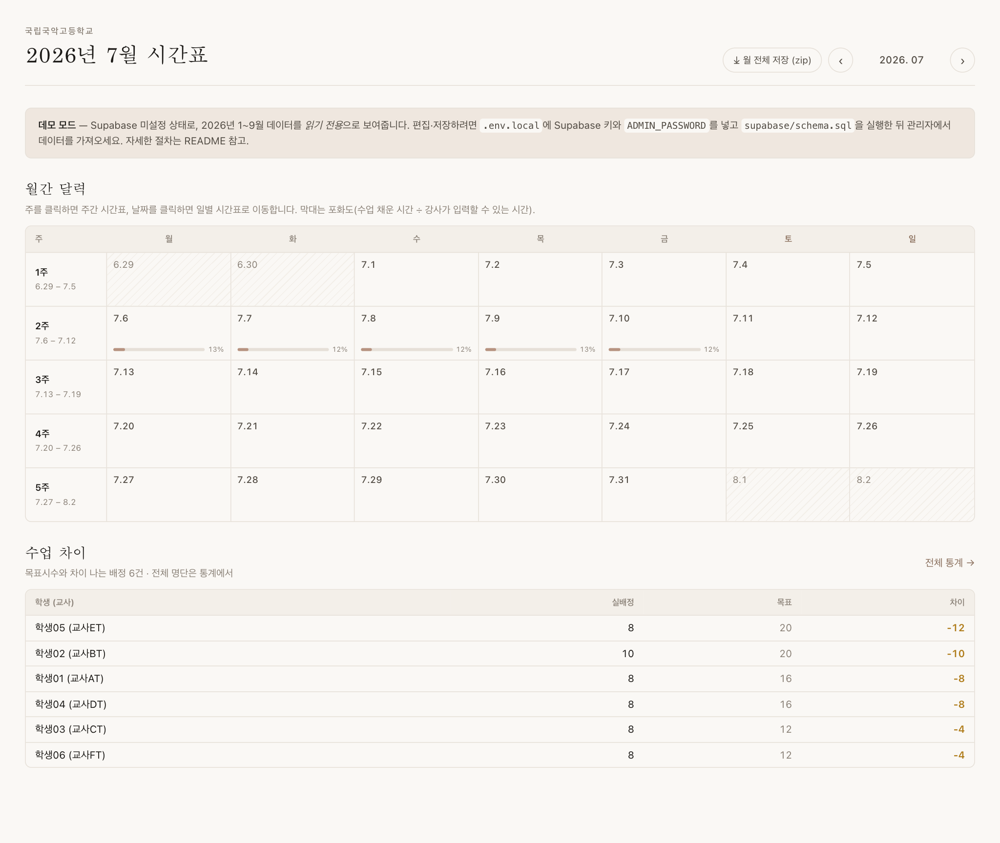
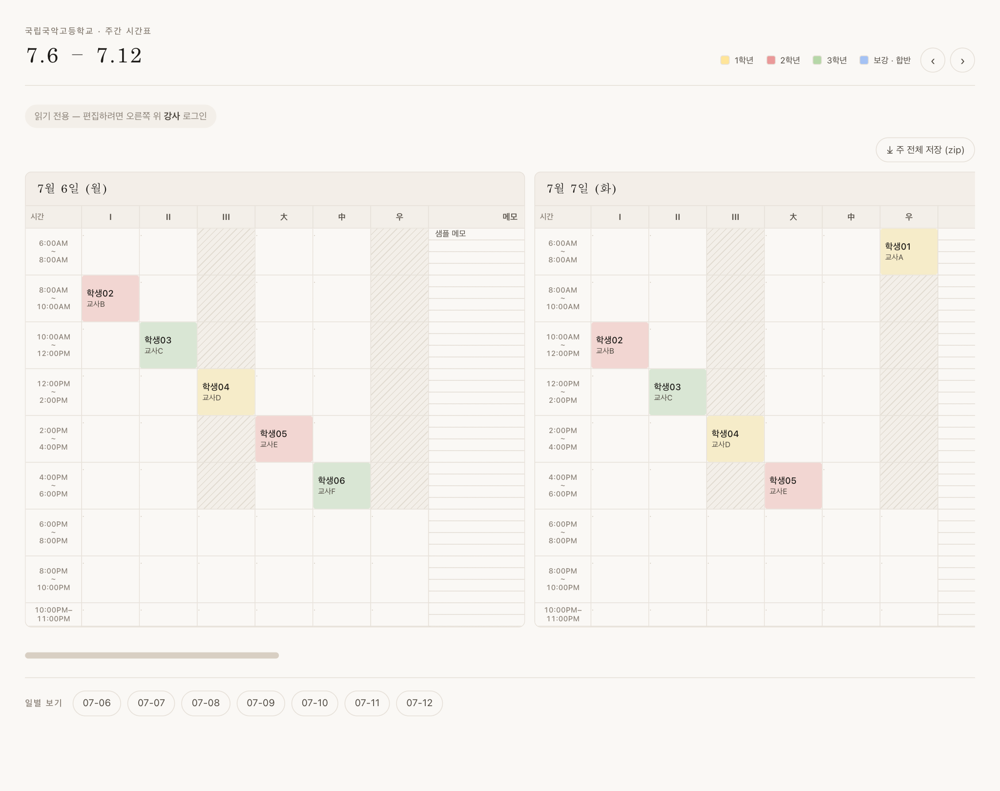
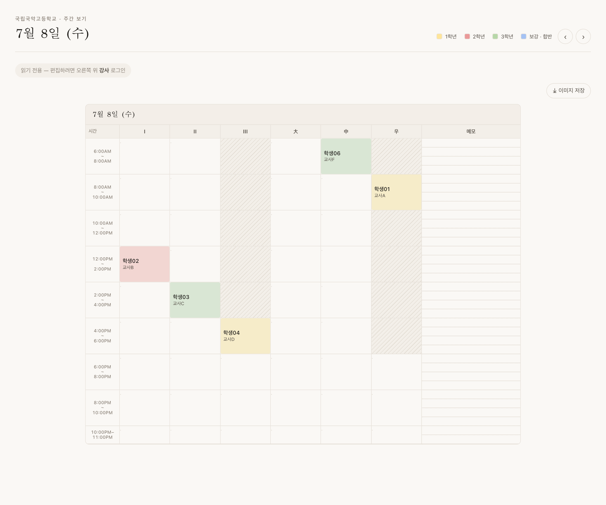
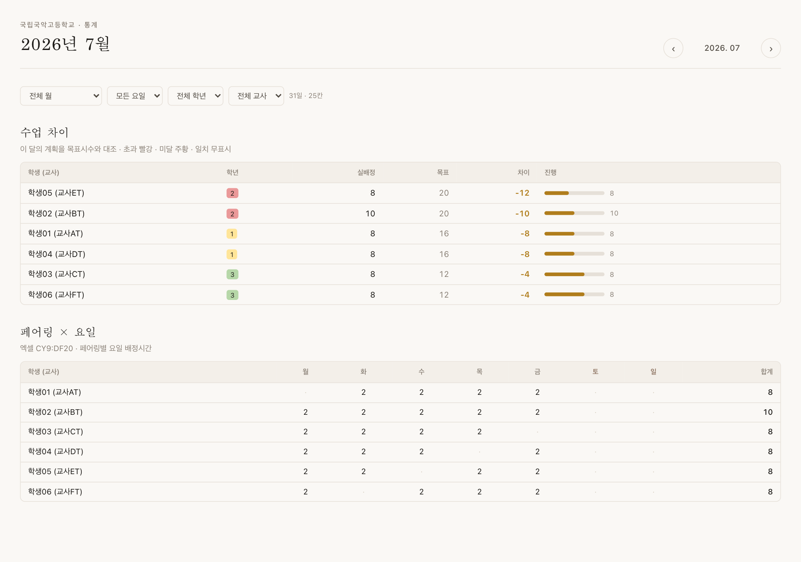
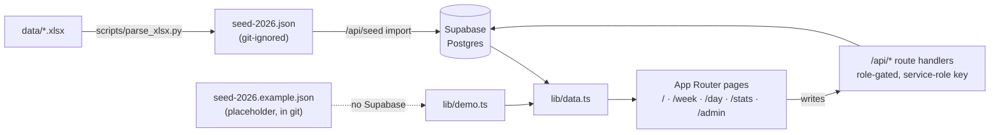

# Gukak Timetable

**A web app that replaces the monthly Excel workbook used to schedule instructors and rehearsal rooms at the National Gugak High School (국립국악고등학교).**

[](https://github.com/nemodleo/gukak-timetable/actions/workflows/ci.yml)


Each month the school builds a private-lesson timetable by hand in a spreadsheet: one
student is paired with one instructor, given a target number of contact hours, and slotted
into a 7-day × 6-room × 30-minute grid. The spreadsheet then computes — with a wall of
formulas — how the plan compares to each student's target, how hours fall across weekdays,
and which rooms are busy.

This project turns that workbook into a shared, editable web app:

- **Drill down** from a month calendar → a week grid → a single day.
- **Edit in place** with role-based permissions (admin, instructor, read-only student view).
- **Per-month rosters and targets** — the student ↔ instructor list is rebuilt every month,
  and the monthly statistics verify the plan against *that month's* targets.
- **Reproduces the spreadsheet's math** — target-vs-actual per pairing, and hours per
  pairing broken out by weekday *and* by week — so the numbers match what staff already trust.
- **Per-day grid overrides** — rooms and time bands can differ day to day (exam weeks,
  holidays); the parser reads the real bands from each day's time column.
- **Exports PNG images** of any day or full week for sharing in messengers and printouts.
- **Imports the original `.xlsx`** through a Python parser, including the grey "no-class"
  cells the spreadsheet uses to block out unavailable time.

---

## Screens

| Month calendar | Week grid |
| --- | --- |
|  |  |

| Day view | Monthly statistics |
| --- | --- |
|  |  |

> Screenshots use the bundled **anonymized sample data** (`학생01 (교사AT)` …). Real rosters
> contain minor students' names and are never committed to this repository.

---

## Manuals (한국어)

Task-oriented guides for each role, with screenshots — meant to be handed to school staff.

| 매뉴얼 | 대상 | 내용 |
| --- | --- | --- |
| [관리자 매뉴얼](docs/admin-manual.md) | 시간표 담당 교사 | 전 기능 — 로그인·권한, 세 뷰, 칸 편집, 비활성 칸, 그리드 구조, 명단·목표시수·설정·데이터, 통계, 자주 하는 작업, 문제 해결 |
| [강사 매뉴얼](docs/instructor-manual.md) | 강사 | 로그인, 보기/편집, 학생 배정·이동, 메모, 되돌리기, 이미지 저장, 통계 열람 |
| [학생 매뉴얼](docs/student-manual.md) | 학생 | 로그인 없이 월→주→일 보기, 색·빗금 의미, 내 시간표 이미지 저장 |

---

## How it works

### Roles

| Role | How they get in | What they can do |
| --- | --- | --- |
| **Student** | no login | read-only: month, week, day; PNG export. No stats. |
| **Instructor** | `INSTRUCTOR_PASSWORD` | + view stats, assign a pairing to a cell, edit day memos |
| **Admin** | `ADMIN_PASSWORD` | + no-class blocks, room/time-block structure, per-month roster & targets, settings, import/export |

A signed-in user still has to flip the **View / Edit** toggle before the grid accepts
changes. Auth is a signed HMAC cookie (`<role>.<timestamp>.<signature>`) — there are no
user accounts, one shared password per role. Set `ADMIN_SESSION_SECRET` in production so
tokens are not signed with the password itself.

### Data model (Supabase / Postgres)

| Table | Purpose |
| --- | --- |
| `settings` | school name, active year/month, week start, default rooms and time blocks |
| `pairings` | one student ↔ instructor pair **per month** (`ym = "2026-07"`), with grade and target hours; `unique(ym, label)` |
| `schedule_cells` | one grid cell: `date` × `room` × `slot_index`, `kind` of `pairing` \| `block`, optional memo text and colour |
| `day_memos` | ruled memo column — one line per 30-min mark, keyed `"HH:MM"` |
| `day_configs` | per-day overrides of rooms / time blocks; the importer emits one for every day whose bands differ from the settings default |

A **cell** is empty, a **student (pairing)**, or a **no-class block**. Blocks carry the
former "free text" features — a memo and a colour — but only an admin may create or edit
one; by default a block renders as a diagonal hatch.

### Monthly scope

`pairings.ym` makes every month self-contained. The week and day views load the roster for
the month(s) they touch, so a week that straddles a month boundary resolves each day
against the correct list. Statistics for a month clip every week to that month before
counting, so neighbouring-month days never leak in.

### Statistics

Sign-in required (instructor or admin). Ported from the spreadsheet's formula block:

- **목표 차이 / target difference** — actual assigned hours vs. the month's target per
  pairing; rows sorted over → under → exact → no-target, with over red and under amber.
- **페어링 × 요일·주차 / pairing × weekday & week** — assigned hours per pairing per
  weekday, then per week-of-month, then the row total.

Hours are computed proportionally from the 30-minute grid, honouring per-day room/time
overrides. Weeks are clipped to the selected month before counting, so a week that
straddles a month boundary never leaks neighbouring-month days into the totals.

---

## Architecture



Pages render on the server from `lib/data.ts`, which talks to Supabase with the
service-role key — or, when Supabase is unset, falls back to `lib/demo.ts` reading the
bundled placeholder seed. All writes go through `/api/*` route handlers that check the
HMAC cookie role (`_guard.ts`) before touching the database; row-level security keeps the
tables public-read and service-role-write.

---

## Getting started

### Prerequisites

- Node.js 20+
- npm
- (optional) Python 3 + `openpyxl`, only to re-parse source spreadsheets

### Run in demo mode (no secrets)

```bash
npm install
npm run dev
```

With no Supabase environment set, the app boots read-only against a small anonymized
sample and shows a "demo mode" banner. (`predev`/`prebuild`/`pretest` run
`scripts/ensure-seed.mjs`, which copies `src/data/seed-2026.example.json` to
`src/data/seed-2026.json` on a fresh checkout.)

### Run against Supabase

1. Create a project at <https://supabase.com> (free tier is enough).
2. Paste all of `supabase/schema.sql` into the **SQL Editor** and run it.
3. Copy `.env.example` to `.env.local` and fill in:

   | Variable | Where |
   | --- | --- |
   | `NEXT_PUBLIC_SUPABASE_URL` | Project Settings → API → Project URL |
   | `SUPABASE_ANON_KEY` | Project Settings → API → `anon` public |
   | `SUPABASE_SERVICE_ROLE_KEY` | Project Settings → API → `service_role` (server only) |
   | `ADMIN_PASSWORD`, `INSTRUCTOR_PASSWORD` | any strings |
   | `ADMIN_SESSION_SECRET` | any long random string |

4. `npm run dev`, open `/admin`, log in, and use **Data → "JSON 파일 선택"** to import a
   seed or backup JSON (`src/data/seed-2026.json`, or a file from **Data → 백업 다운로드**).

### Re-parse the source spreadsheets (optional)

```bash
python3 -m venv .venv && .venv/bin/pip install openpyxl
make seed        # data/*.xlsx  →  src/data/seed-2026.json
```

Drop the monthly workbooks (`2026년 N월.xlsx`) into `data/`. The parser reads each month's
`SET UP` sheet as that month's roster, classifies grey fills as no-class blocks, maps the
spreadsheet's fill colours to cell colours, reads each day's real time bands, and strictly
filters out spill-over days from adjacent months. **`src/data/seed-2026.json` holds real
minor students' names — it is git-ignored and untracked. Do not commit it.** The only seed
in git is `seed-2026.example.json` (the anonymized placeholder).

---

## Testing

```bash
npm test          # vitest — lib/schedule, lib/time, lib/stats
npm run typecheck # tsc --noEmit
make test         # vitest + scripts/test_parse_xlsx.py (parser helpers)
make check        # test + build + lint  (what CI runs)
```

CI (`.github/workflows/ci.yml`) runs lint, typecheck, the vitest suite, a production
build, and the Python parser tests on every push and PR.

---

## Deployment

The [`Makefile`](Makefile) wraps the common tasks:

```bash
make check       # test + build + lint
make deploy      # vercel --prod (after check)
make env-push    # push .env.local values to Vercel (strips inline comments)
```

`make help` lists every target.

---

## Privacy

The rosters this app manages contain **minor students' names and full schedules**. Two
things follow from that:

- The generated seed (`src/data/seed-2026.json`) is never committed — see the note above.
- With Supabase wired up, RLS makes every table **public-read** and the student view needs
  no login, so the whole timetable is world-readable at the deployed URL. That is a
  deliberate "students can check their own slot" choice; if it is not right for your
  deployment, add a gate or an unguessable URL before pointing production at real data, and
  keep Vercel's Deployment Protection on until you have decided.

---

## Project structure

```
src/
  app/
    page.tsx              month calendar
    week/[key]/            week grid (7 days × rooms × slots)
    day/[date]/            single-day grid, editable
    stats/                 monthly statistics (sign-in required)
    admin/                 gated: schedule / roster / settings / data tabs
    api/                   auth, schedule, pairings, memos, settings,
                           day-config, seed, export  (role-gated via _guard.ts)
  components/
    MonthCalendar, DayGrid, DayPanel, Cell, ScheduleBoard, StatsView,
    Capture / DayCapture / MonthCapture   (PNG export)
    admin/  ScheduleEditor, RosterEditor, SettingsForm, DataPanel, AdminGate
  lib/
    schedule.ts   week/month/ym helpers, slot geometry   (+ schedule.test.ts)
    stats.ts      target vs. actual, weekday & week matrix   (+ stats.test.ts)
    time.ts       30-minute slot math                    (+ time.test.ts)
    data.ts       Supabase queries (falls back to demo.ts)
    demo.ts       serves the seed JSON when Supabase is unset
    auth.ts       HMAC cookie roles
  data/
    seed-2026.example.json   anonymized placeholder (the only seed in git)
supabase/schema.sql          tables + re-runnable reconcile block
scripts/
  parse_xlsx.py              .xlsx → seed-2026.json   (+ test_parse_xlsx.py)
  ensure-seed.mjs            copies the example seed into place on checkout
.github/workflows/ci.yml     lint · typecheck · test · build · parser tests
```

---

## License

Source code is released under the [MIT License](LICENSE). The real timetable data it is
built to manage — student and instructor names, schedules — is **not** part of this
repository and is not covered by that license.
