# 관리자 매뉴얼

국립국악고등학교 강사·강의실 시간표 웹앱의 모든 기능을, 관리자가 실제로 하는 순서대로 정리했습니다.
강사·학생이 볼 수 있는 범위는 [강사 매뉴얼](instructor-manual.md) · [학생 매뉴얼](student-manual.md) 참고.

> 화면은 익명 예시 데이터(`학생01 (교사AT)` …)로 촬영했습니다. 조작 방법은 실제 환경과 같습니다.

---

## 0. 개요

매달 손으로 만들던 개인지도 시간표(엑셀)를 대신하는 앱입니다. 한 **학생**과 한 **교사**를 짝지어(**배정**)
목표시수를 정하고, **7일 × 6강의실 × 시간블록** 격자에 넣습니다. 화면은 세 단계로 좁혀 봅니다.

- **월간 달력** — 그 달 전체를 한눈에. 주/날짜를 클릭해 아래로 내려갑니다.
- **주간 시간표** — 7일 격자. 실제 배정·편집이 일어나는 곳.
- **일간 시간표** — 하루만 크게.
- **통계** — 그 달 계획을 목표시수와 대조 (강사·관리자 전용).
- **관리자 페이지** — 명단·목표시수·설정·데이터 가져오기.

> **데모 모드** — 화면 맨 위에 *"데모 모드 — Supabase 미설정"* 배너가 보이면 데이터베이스가 연결되지 않은
> 상태입니다. 이때는 **읽기 전용**이라 어떤 편집도 저장되지 않습니다.

---

## 1. 로그인과 권한

### 1.1 로그인

화면 오른쪽 위에서 **강사** 또는 **관리자** 버튼을 누르면 비밀번호 입력창이 열립니다. 계정은 없고,
역할마다 **공용 비밀번호 1개**입니다.

| 헤더 팝오버 | `/admin` 로그인 카드 |
| --- | --- |
|  | 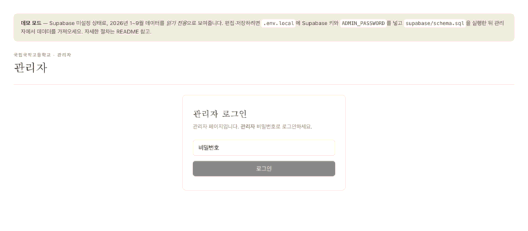 |

관리자 비밀번호로 로그인하면 자동으로 관리자 페이지로 이동합니다. 강사 비밀번호로 로그인하면 시간표
화면에 **보기 / 편집** 토글이 생깁니다.

### 1.2 세션과 로그아웃

로그인 상태는 브라우저에 **30일** 유지됩니다. 공용 PC에서는 작업 후 오른쪽 위 **로그아웃**을 눌러 주세요.

### 1.3 역할별 권한

| 할 수 있는 것 | 학생(로그인 없음) | 강사 | 관리자 |
| --- | :---: | :---: | :---: |
| 월·주·일 시간표 보기 | ✓ | ✓ | ✓ |
| 이미지로 저장 (일 · 주 zip · 월 zip) | ✓ | ✓ | ✓ |
| 통계 열람 | — | ✓ | ✓ |
| 칸에 학생(교사) 배정 · 이동 · 비우기 | — | ✓ | ✓ |
| 날짜 메모 작성 | — | ✓ | ✓ |
| 비활성(수업 없는) 칸 만들기 · 수정 | — | — | ✓ |
| 강의실 · 시간블록 구조 편집 | — | — | ✓ |
| 명단 · 목표시수 | — | — | ✓ |
| 설정 | — | — | ✓ |
| 데이터 가져오기 · 백업 내보내기 | — | — | ✓ |

강사·관리자가 시간표를 바꾸려면 화면의 **편집** 버튼을 눌러야 합니다. **보기** 모드는 실수로 칸을 건드리지
않도록 하는 읽기 상태입니다.

---

## 2. 화면 둘러보기

### 2.1 상단 바

- **시간표**(로고) — 월간 달력으로.
- **월간 / 통계** — 뷰 전환. *통계는 로그인했을 때만* 보입니다.
- 오른쪽 — 로그인 전엔 *강사 · 관리자* 버튼, 로그인 후엔 역할 표시 + *관리자 페이지* + *로그아웃*.

### 2.2 공통 조작 — 방향키

모든 시간표·통계 화면에서 <kbd>←</kbd> <kbd>→</kbd> 로 이전/다음으로 넘어갑니다. 월간=달, 주간=주,
일간=날짜, 통계=달 단위입니다. 입력칸에 커서가 있을 때는 동작하지 않습니다.

### 2.3 뷰 사이 이동

- 월간에서 왼쪽 **"N주"** 클릭 → 그 주의 주간 시간표.
- 월간·주간에서 **날짜** 클릭 → 그 날의 일간 시간표.
- 일간 화면 오른쪽 위 **주간 보기** → 그 주로 복귀.

---

## 3. 월간 달력 `/`

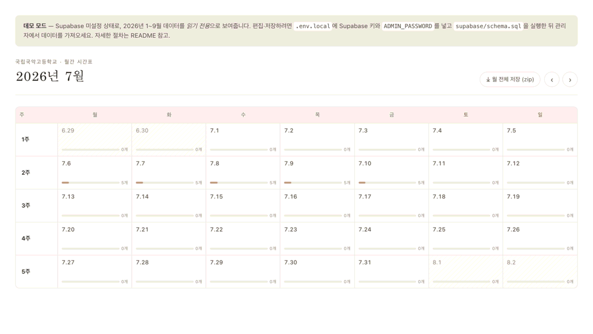

- **왼쪽 "주" 열** — 클릭하면 그 주의 주간 시간표로. 화면이 좁으면 이 열은 자동으로 사라집니다.
- **날짜 칸** — 날짜 + *막대(포화도)* + *숫자(그 날 수업 개수, "N개")*.
  - 포화도 = 배정된 수업 시간 ÷ 강사가 넣을 수 있는 시간(설정된 강의실·시간 범위에서 비활성 시간을 뺀 값).
  - **✕** 표시 = 그 날 수업을 넣을 수 있는 시간이 없음(구조가 없거나 전부 비활성).
- 오른쪽 위 **월 전체 저장 (zip)** — 그 달 모든 날짜 이미지를 한 번에 zip으로 내려받습니다.
- <kbd>←</kbd> <kbd>→</kbd> 로 달 이동.

---

## 4. 주간 시간표 `/week`

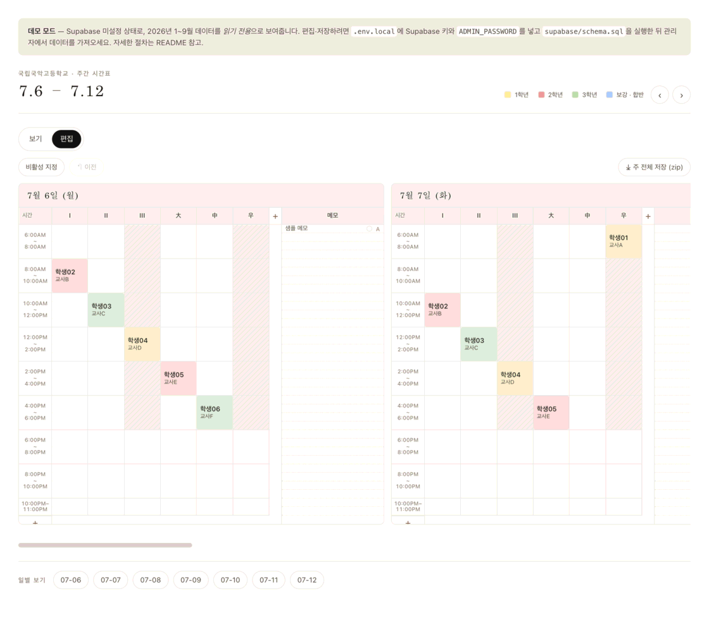

- **격자** — 하루당 6강의실(기본 `I · II · III · 大 · 中 · 우`) × 시간블록.
- **보기 / 편집 토글** — *편집*을 눌러야 칸을 바꿀 수 있습니다.
- **칸 색** = 학년 — 🟨 1학년 · 🟥 2학년 · 🟩 3학년 · 🟦 보강·합반. 사선 빗금 = *비활성* 칸.
- **메모 열**(오른쪽) — 30분 줄 단위 자유 메모. 입력하면 **즉시 자동 저장**됩니다. 줄에 커서를 두거나
  내용이 있으면 그 줄의 *빨강 강조* · *글자 크기* 토글이 나타납니다.
- **이미지 저장** — 주간은 *주 전체 저장 (zip)*(7일 묶음), 일간은 *이미지 저장*(1장).
- 아래 **일별 보기** 칩 — 각 날짜의 일간 화면으로.
- <kbd>←</kbd> <kbd>→</kbd> 로 주 이동.

일간 시간표(`/day`)는 같은 격자를 하루만 크게 보여줍니다. 오른쪽 위 *주간 보기* 링크로 그 주로 돌아갑니다.

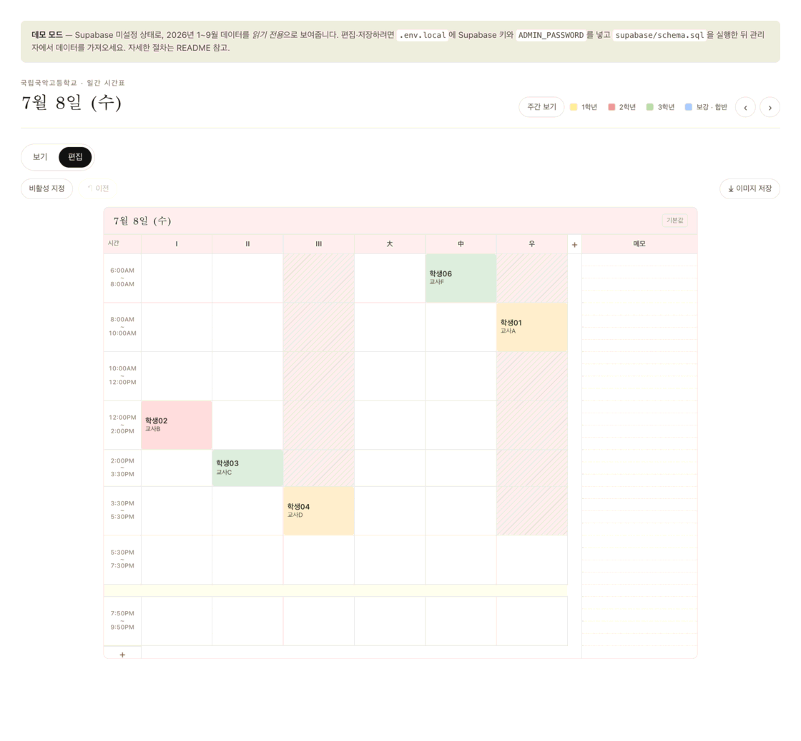

---

## 5. 칸 편집 — 배정 · 비활성

### 5.1 학생 배정하기

편집 모드에서 빈 칸(또는 이미 배정된 칸)을 클릭하면 편집 창이 열립니다. **학생(교사)** 탭에서 검색창으로
좁힌 뒤 목록에서 골라 **저장**합니다.

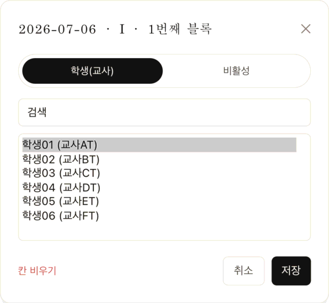

목록에는 그 칸 **날짜가 속한 달의 명단**만 나옵니다(달마다 명단이 다르므로).

### 5.2 비활성 칸 만들기 · *관리자 전용*

수업을 넣지 않을 시간대(옛 "회색·비수업")입니다. 편집 창의 **비활성** 탭에서 만듭니다. 메모(선택)와
배경색을 지정할 수 있고, 색을 "없음"으로 두면 기본인 **사선 빗금**으로 표시됩니다.

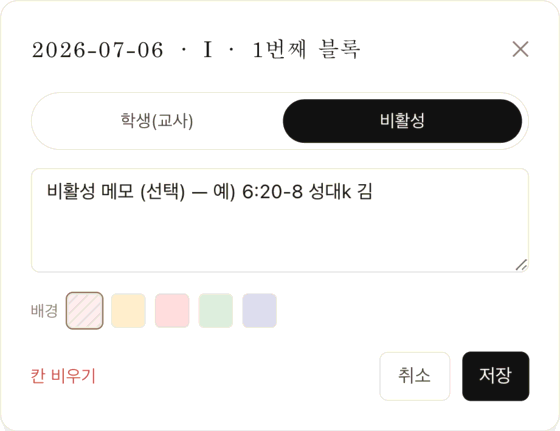

### 5.3 칸 비우기

편집 창 왼쪽 아래 **칸 비우기**(빨강)를 누르면 그 칸의 배정·비활성이 해제되어 빈 칸이 됩니다.

### 5.4 되돌리기

툴바의 **↶ 이전** 버튼 또는 <kbd>⌘ / Ctrl</kbd> + <kbd>Z</kbd> 로 마지막 편집을 취소합니다. 드래그로
여러 칸을 한꺼번에 바꿨다면 그 묶음 전체가 한 번에 되돌아갑니다.

### 5.5 비활성 지정 드래그 · *관리자 전용*

툴바의 **비활성 지정**을 켠 뒤 칸 위를 드래그하면 지나간 칸들을 한 번에 비활성으로 만들거나 해제합니다.
아침·저녁처럼 넓은 구간을 막을 때 편합니다.

> **자동 저장** — 칸 편집에는 따로 "전체 저장" 버튼이 없습니다. 저장을 누르거나 드래그를 끝내는 순간
> 바로 반영됩니다.

---

## 6. 그리드 구조 편집 · *관리자 전용*

강의실과 시간블록은 편집 모드에서 각 일자 격자의 **머리글에서 직접** 바꿉니다.

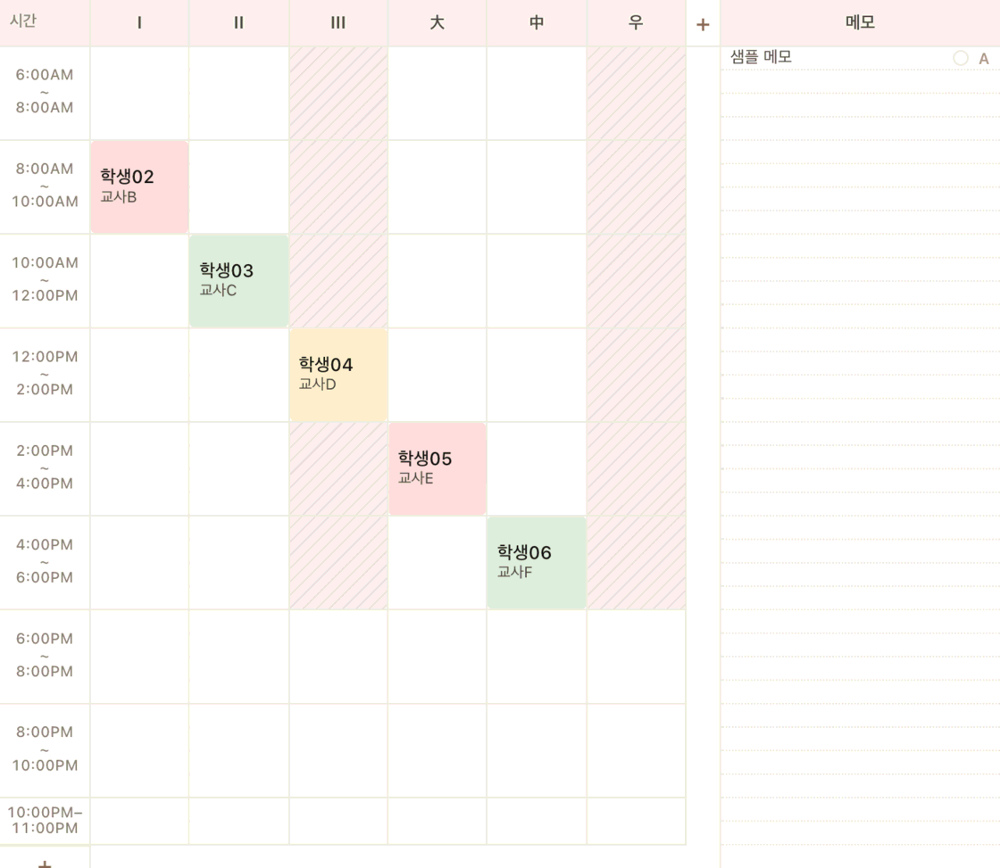

- **강의실** — 이름을 클릭해 바꾸고, 칸에 마우스를 올리면 나타나는 **✕** 로 삭제, 맨 끝 **+** 로 추가.
- **시간블록** — 시간 라벨을 클릭해 시작·끝을 수정, **✕** 로 삭제, **+** 로 추가. 새 블록은 *직전 블록
  끝 + 2시간*으로 생기고, 다른 블록과 **겹치지 않도록** 자동 조정됩니다.
- 이 변경은 **그 날짜에만** 적용됩니다(다른 날은 설정 탭의 기본값을 씁니다). 그 날짜를 다시 기본값으로
  돌리려면 *기본값으로 되돌리기*를 누릅니다.
- 강의실을 지우거나 시간을 줄이면, 그 밖으로 벗어난 칸의 배정도 함께 정리됩니다.

---

## 7. 관리자 페이지 `/admin`

탭이 4개입니다 — **시간표 편집 · 명단 · 설정 · 데이터**.

### 7.1 시간표 편집

4~6장의 편집기를 관리자 페이지 안에서 그대로 씁니다. 위쪽 *‹ ›* 또는 <kbd>←</kbd> <kbd>→</kbd> 로
주를 넘깁니다.

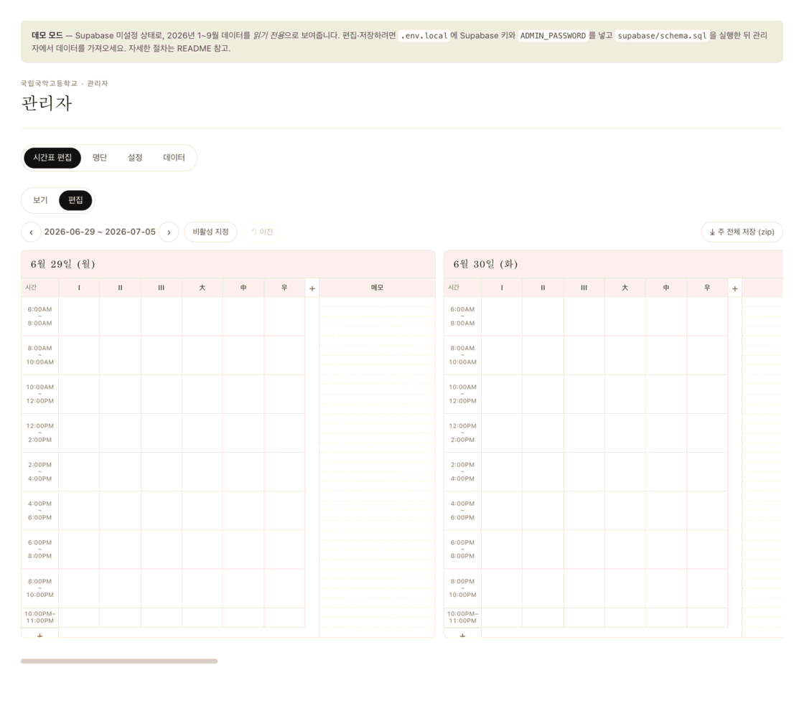

### 7.2 명단

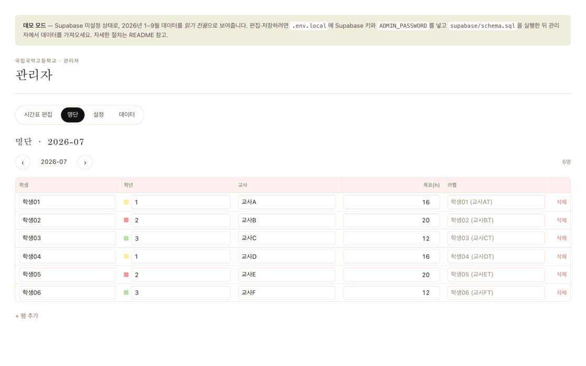

- **명단은 달마다 따로**입니다. *‹ 2026-07 ›*(또는 <kbd>←</kbd> <kbd>→</kbd>)로 달을 바꿉니다.
- 열 — **학생** 이름 · **학년** · **교사** · **목표(h)** 목표시수 · **라벨**. 라벨은 시간표 칸에
  표시되는 이름이며, 비워 두면 `학생 (교사T)` 로 자동 생성됩니다.
- *+ 행 추가* / 각 행 오른쪽 *삭제*.
- **입력칸에서 커서가 벗어나면 자동 저장**됩니다. "저장 중… / 저장됨 / 저장 실패" 상태가 표시됩니다.
- 그 달 명단이 비어 있으면 *이전 달 명단 불러오기* 버튼이 나옵니다 — 지난 달 명단을 그대로 복사해 온 뒤
  인원·교사·목표시수만 고치면 됩니다.

### 7.3 설정

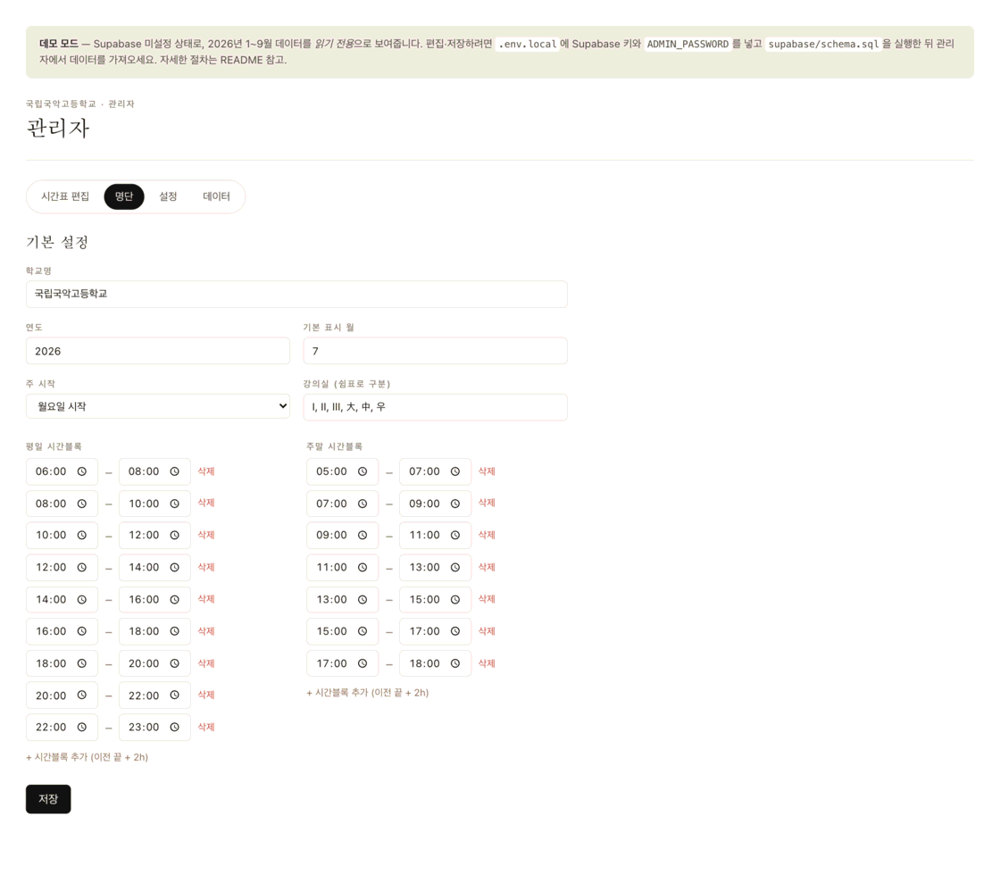

- **학교명**, **기준 연도·월**(홈에서 처음 보여줄 달), **주 시작 요일**(월요일 / 일요일).
- **강의실 목록**, **평일·주말 기본 시간블록** — 날짜별로 따로 바꾸지 않은 날은 이 값을 씁니다
  (엑셀 "SET UP" 시트에 해당).

### 7.4 데이터

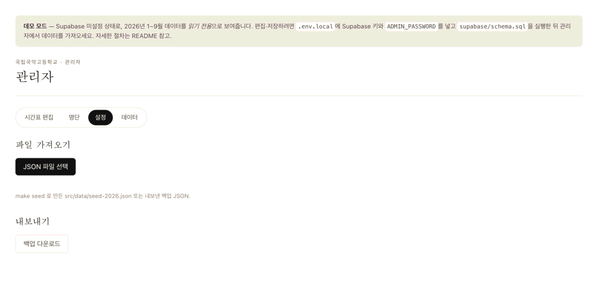

- **파일 가져오기** — *JSON 파일 선택* 후 `make seed` 로 만든 `src/data/seed-2026.json` 또는
  이전에 내보낸 백업 JSON을 고릅니다. 가져오는 중에는 *"가져오는 중… 수십 초 걸릴 수 있습니다"*가 뜨고,
  끝나면 *"✓ 가져오기 완료 · pairings N · cells N · …"* 로 바뀝니다. 이 화면을 벗어나지 말고 기다리세요.
- **내보내기** — *백업 다운로드* 로 현재 데이터베이스 전체를 JSON 한 파일로 받습니다.

> **가져오기 주의** — 가져오기는 같은 칸·명단을 **덮어씁니다**. 큰 파일은 수십 초 걸리고, 도중에 창을
> 닫으면 절반만 반영될 수 있습니다. **가져오기 전에 먼저 *백업 다운로드***로 현재 상태를 받아 두세요.

---

## 8. 통계 `/stats` · *강사·관리자*

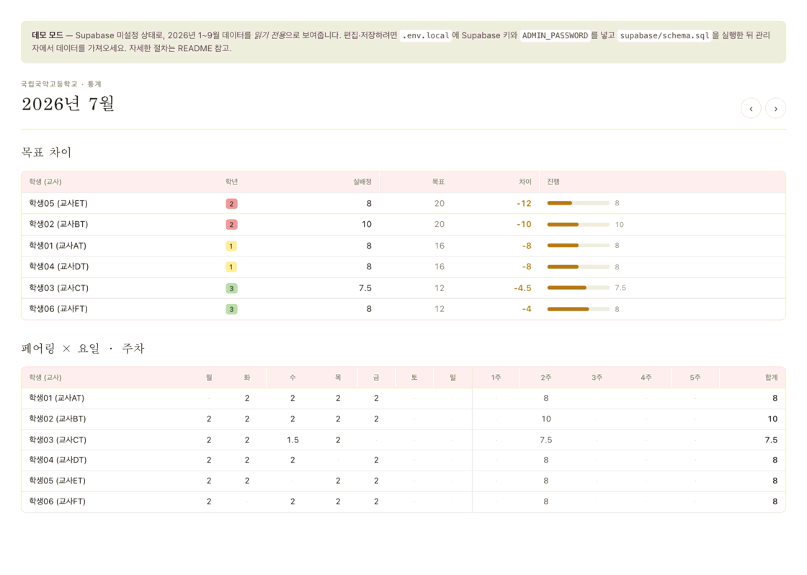

<kbd>←</kbd> <kbd>→</kbd> 또는 *‹ ›* 로 달을 바꿉니다. 로그인하지 않으면 통계 메뉴 자체가 보이지 않습니다.

- **목표 차이** — 학생(교사) · 학년 · **실배정** · **목표** · **차이** · 진행 막대.
  - 정렬 — 초과(+) 큰 순 → 미달(−) 큰 순 → 정확히 일치 → 목표 미입력.
  - 색 — 초과 빨강, 미달 주황, 일치는 표시 없음.
- **페어링 × 요일 · 주차** — 학생(교사)별로 요일(월~일)과 주차(1주~N주)에 배정된 시간, 그리고 합계.

---

## 9. 자주 하는 작업

### 새 학생 배정하기
1. **명단** 탭에서 해당 달을 고르고 *+ 행 추가* → 학생·학년·교사·목표시수 입력(입력칸 밖을 클릭하면 저장).
2. **주간/일간 시간표**에서 *편집* 모드로 전환.
3. 넣을 칸을 클릭 → *학생(교사)* 탭에서 검색·선택 → *저장*.

### 수업 시간 옮기기
1. 새 칸을 클릭해 그 학생을 배정하고 *저장*.
2. 원래 칸을 클릭 → *칸 비우기*.

### 비활성(수업 없는) 시간 지정
- 넓게: *편집* → 툴바 *비활성 지정* 켜고 드래그.
- 한 칸: 칸 클릭 → *비활성* 탭 → (필요하면 메모·색) → *저장*.

### 새 달 준비하기
1. **명단** 탭에서 새 달로 이동 → *이전 달 명단 불러오기*.
2. 빠지거나 바뀐 학생·교사·목표시수를 수정(자동 저장).
3. 필요하면 **설정** 탭에서 *기준 월*을 그 달로 변경.

### 엑셀에서 대량으로 반영하기
1. 로컬에서 `make seed` 실행 → `src/data/seed-2026.json` 생성.
2. **데이터** 탭 → *백업 다운로드*로 현재 상태 백업.
3. *JSON 파일 선택* → 방금 만든 `seed-2026.json` → 완료 표시까지 대기.

### 정기 백업
**데이터 → 백업 다운로드**. 큰 변경 전과 주기적으로(예: 매주) 받아 두면 실수해도 그 파일을 다시 가져와
복구할 수 있습니다.

---

## 10. 문제 해결

| 증상 | 원인 · 해결 |
| --- | --- |
| "데모 모드" 배너가 보임 | 데이터베이스 미연결. 읽기 전용이라 저장이 안 됩니다. 배포·Supabase 설정 필요(README). |
| 로그인이 안 됨 | 비밀번호 확인. macOS에서 비밀번호 칸이 한글로 전환되지 않는 것은 OS 제약 — 비밀번호는 영문·숫자로. |
| 저장된 건지 모르겠음 | **명단**은 입력칸 밖을 클릭해야 저장되고 상태가 "저장됨"으로 바뀝니다. **시간표**는 저장·드래그 즉시 반영. |
| 시간대가 실제와 다름 | 격자 머리글에서 그 날짜만 수정하거나, 최신 시드를 **데이터** 탭에서 다시 가져오면 맞춰집니다. |
| 통계 메뉴가 안 보임 | 강사 또는 관리자로 로그인해야 나타납니다. |
| 이미지 저장이 느리거나 멈춤 | 브라우저 탭을 화면에 띄운 상태로 두고 기다리세요. 백그라운드 탭에서는 캡처가 느립니다. |
| 가져오기가 실패로 끝남 | 파일 손상 또는 서버 무응답. 백업 파일을 다시 선택하고, 계속 실패하면 파일을 나눠 시도. |

---

## 11. 키보드 단축키

| 키 | 동작 | 어디서 |
| --- | --- | --- |
| <kbd>←</kbd> <kbd>→</kbd> | 이전 / 다음 | 월간(달) · 주간(주) · 일간(날짜) · 통계(달) |
| <kbd>⌘ / Ctrl</kbd> + <kbd>Z</kbd> | 마지막 칸 편집 되돌리기 | 시간표 편집 모드 |

입력칸에 커서가 있을 때는 방향키 이동이 동작하지 않습니다.

---

## 12. 용어

| 용어 | 뜻 |
| --- | --- |
| 배정 (페어링) | 한 학생 ↔ 한 교사 짝. 그 달의 목표시수를 가집니다. |
| 목표시수 | 그 학생이 그 교사에게 그 달에 받기로 한 수업 시간(h). 통계의 "목표". |
| 라벨 | 시간표 칸에 표시되는 이름 문자열. 예: `학생01 (교사AT)`. |
| 비활성 칸 | 수업을 넣지 않는 시간대. 옛 이름 "회색·비수업". 관리자만 만들 수 있고, 기본은 사선 빗금. |
| 포화도 | 배정된 수업 시간 ÷ 강사가 넣을 수 있는 시간(설정 범위 − 비활성). 월간 달력의 막대. |
| 시간블록 | 하루 타임라인의 한 칸(예: 06:00–08:00). 날짜별로 다를 수 있습니다. |
| 데모 모드 | 데이터베이스가 연결되지 않아 읽기 전용으로만 도는 상태. |
