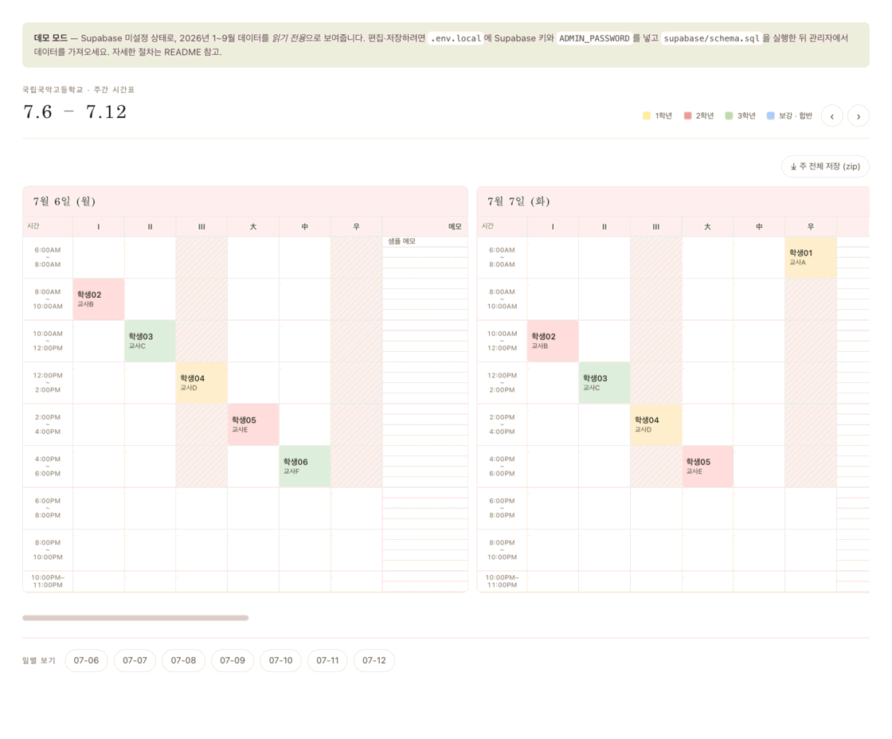
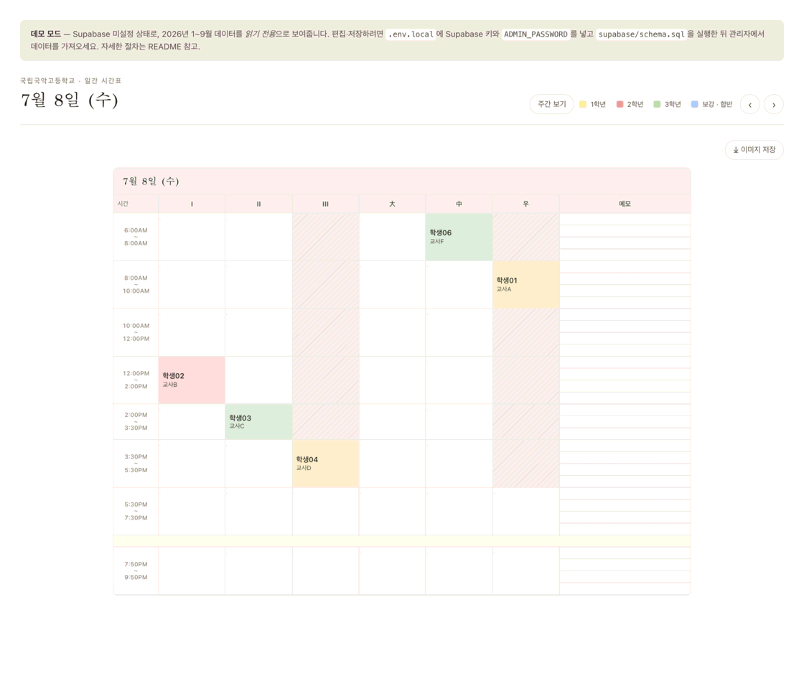

# 학생 매뉴얼

시간표를 **보는 방법**입니다. 로그인이 필요 없고, 학생은 내용을 바꿀 수 없습니다(편집은 강사·관리자).

> 화면은 익명 예시 데이터(`학생01 (교사AT)` …)로 촬영했습니다.

---

## 1. 접속

주소로 바로 들어가면 됩니다. 로그인 없이 이번 학기 시간표를 볼 수 있습니다.

- **시간표**(로고) → 월간 달력.
- **월간** → 월간 달력.
- 오른쪽 *강사 · 관리자* 버튼은 선생님용이라 신경 쓰지 않아도 됩니다.

---

## 2. 월간 달력에서 시작

- 왼쪽 **"N주"** 를 누르면 그 주 전체 시간표로,
- **날짜** 를 누르면 그 날 하루 시간표로 이동합니다.
- 날짜 칸의 작은 막대·숫자는 그 날 수업이 얼마나 있는지 나타내는 표시입니다(자세히 볼 필요는 없습니다).
- <kbd>←</kbd> <kbd>→</kbd> 방향키로 이전/다음 달로 넘어갑니다.

---

## 3. 주간·일간 시간표 보는 법

- 세로축은 **시간**, 가로축은 **강의실**(`I · II · III · 大 · 中 · 우`)입니다.
- 색이 칠해진 칸이 **수업**입니다. 칸 안에 **학생 이름 (교사)** 이 적혀 있습니다.
  - 색은 학년 구분입니다 — 🟨 1학년 · 🟥 2학년 · 🟩 3학년 · 🟦 보강·합반.
- **사선 빗금** 칸은 수업을 넣지 않는 시간대입니다.
- 오른쪽 **메모** 칸은 선생님이 적어 두는 안내입니다.
- <kbd>←</kbd> <kbd>→</kbd> 로 이전/다음 주(일간에서는 날짜)로 이동합니다.

일간 화면 오른쪽 위 **주간 보기** 를 누르면 그 주 전체로 돌아갑니다.

---

## 4. 내 시간표를 이미지로 저장

- 주간 화면 — **주 전체 저장 (zip)** : 그 주 7일 이미지를 한 번에.
- 일간 화면 — **이미지 저장** : 그 날 1장.
- 월간 화면 — **월 전체 저장 (zip)** : 그 달 전체.

저장이 느리면 브라우저 탭을 화면에 띄운 채로 잠깐 기다리세요.

---

## 5. 자주 묻는 것

| 궁금한 점 | 답 |
| --- | --- |
| 로그인해야 하나요? | 아니요. 보기만 할 거면 로그인 없이 됩니다. |
| 내 수업이 안 보여요 / 시간이 틀려요 | 담당 선생님이나 시간표 담당 선생님께 알려 주세요. 학생은 고칠 수 없습니다. |
| "데모 모드" 라는 문구가 떠요 | 임시 화면입니다. 실제 시간표 주소인지 확인하세요. |
| 통계 메뉴가 없어요 | 통계는 선생님용입니다. |
